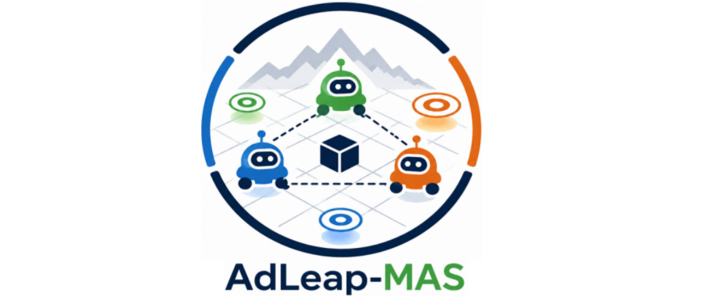

<h1 align="center">AdLeap-MAS: An Open-Source Multi-Agent Simulator for Ad-hoc Reasoning</h1>

> **AAMAS 2022** – *In Proceedings of the 21st International Conference on Autonomous Agents and Multiagent Systems. <a href="#alves2022adleapmas">[1]</a>*

<p align="center">

</p>

AdLeap-MAS is an open-source framework for developing, evaluating, and benchmarking algorithms for **ad-hoc reasoning**, **online planning**, and **multi-agent systems**. It provides a modular architecture that allows researchers to rapidly prototype new environments, reasoning algorithms, and agent models while reusing existing components.

If you use AdLeap-MAS in your research, please cite our paper.

---

## Citation

<div style="max-width: 800px; overflow-x: auto;">

```bibtex
@inproceedings{alves2022adleapmas,
  author = {do Carmo Alves, Matheus Aparecido and Varma, Amokh and Elkhatib, Yehia and Soriano Marcolino, Leandro},
  title = {AdLeap-MAS: An Open-Source Multi-Agent Simulator for Ad-Hoc Reasoning},
  year = {2022},
  isbn = {9781450392136},
  publisher = {International Foundation for Autonomous Agents and Multiagent Systems},
  address = {Richland, SC},
  abstract = {Ad-hoc reasoning models are recurrently used to solve some of our daily tasks. Intending to avoid worthless investments or spend valuable resources, these smart systems requires a proper evaluation before acting in the real-world. In this paper, we demonstrate AdLeap-MAS, a novel framework focused on enabling quick and easy testing of smart algorithms in ad-hoc reasoning domains.},
  booktitle = {Proceedings of the 21st International Conference on Autonomous Agents and Multiagent Systems},
  pages = {1893–1895},
  numpages = {3},
  keywords = {autonomous systems, ad-hoc reasoning, open-source, online planning, simulation framework},
  location = {Virtual Event, New Zealand},
  series = {AAMAS '22}
}
```
</div>

---

# Table of Contents
- [Table of Contents](#table-of-contents)
- [Introduction](#introduction)
  - [🚀 Quick Start](#-quick-start)
    - [1. Clone the repository](#1-clone-the-repository)
    - [2. Create a Python virtual environment (recommended)](#2-create-a-python-virtual-environment-recommended)
    - [3. Installation](#3-installation)
  - [Usage :muscle:](#usage-muscle)
    - [1. Running available environments](#1-running-available-environments)
    - [2. How to change the components within the framework?](#2-how-to-change-the-components-within-the-framework)
    - [3. Where and how to implement my reasoning algorithm!?](#3-where-and-how-to-implement-my-reasoning-algorithm)
- [Domain Examples](#domain-examples)
    - [Level-Foraging Environment](#level-foraging-environment)
- [Development](#development)
- [References](#references)

---

# Introduction

## 🚀 Quick Start

Getting AdLeap-MAS up and running only takes a few minutes.

### 1. Clone the repository

```bash
git clone https://github.com/lsmcolab/adleap-mas.git
cd adleap-mas
```

### 2. Create a Python virtual environment (recommended)

We recommend installing AdLeap-MAS in a dedicated Python environment.

<summary><strong>Option 1 (Recommended): Conda</strong></summary>

```bash
conda create -n adleap python=3.10
conda activate adleap
```


<details>
<summary><strong>Option 2: Python venv</strong></summary>

- Linux/macOS

```bash
python3 -m venv .venv
source .venv/bin/activate
```

- Windows (PowerShell)

```powershell
python -m venv .venv
.venv\Scripts\Activate.ps1
```

</details>

### 3. Installation

All required Python packages are listed in `requirements.txt`.

Whenever dependencies are updated simply execute

```bash
pip install -r requirements.txt --upgrade
```

<details>
<summary><strong>Windows Troubleshooting</strong></summary>

The framework works natively for most experiments.

Some legacy graphical environments may still require WSL together with VcXsrv.

If a `NoSuchDisplay` error appears inside WSL, execute

```bash
export DISPLAY=$(cat /etc/resolv.conf | grep nameserver | awk '{print $2}'):0
```

</details>

---

## Usage :muscle:

### 1. Running available environments

With all dependencies installed, you have to download this GitHub project and set it on your local workspace.
To start the framework, you only need to choose an experiment configuration and run some example file in `./examples/`.
For example, via the command line you can use (within the main project directory):


```bash
python ./examples/levelforaging_smalltest.py --atype ibpomcp --exp_num 0 --id 0 --display True
```

To run a test with IB-POMCP <a href="#alves2024information">[4]</a> in the *Corridor* level-foraging scenario (Scenario ID = 0).
If you want to change the algorithm or the scenario, or even turn the display off, you can simply change the execution flags, which are:

```python
def get_args():
    # 1. Reading the environment settings
    parser = ArgumentParser()
    # default args
    parser.add_argument('--atype', dest='atype', default='pomcp', type=str)     # Agent Type
    parser.add_argument('--exp_num', dest='exp_num', default=0, type=int)       # Experiment Number
    parser.add_argument('--id', dest='id', default=0, type=int)                 # Scenario ID
    parser.add_argument('--mode', dest='mode', default='default', type=str)     # Experiment mode
    parser.add_argument('--display', dest='display', default=False, type=bool)  # Display ON/OFF
    args = parser.parse_args()
    return args
```

That's all folks. At this point, you will have the display popping up and the simulation starting with the chosen components.

**NOTE:** If you want to run/implement different environments, you can create new main files using the same routine presented for the Level-Foraging Environment, which can be easily specified by the following routine:

```python
    """Generic AdLeap-MAS execution routine"""

    env = AdhocReasoningEnv(args)
    state = env.reset()
    
    while not done and env.episode < max_episode:
        env.render()

        next_action, _ = type_planning(state,agent)

        state, reward, done, info = env.step(next_action)

        if done:
            break

    env.close()
```

<a name="sec-components"></a>
### 2. How to change the components within the framework?

<p style="text-align: justify; text-indent: 20px;" >
Changing components of the environment is REALLY not troublesome. The idea is simple: you must have the code that implements your desired element (which can refer to the agents, tasks or even the reasoning module) and add it to the environment's components dictionary. Presenting it clearer, the following code shows the base structure to plug-in components to your experiment:
</p>

```python
    """Generic AdLeap-MAS environment's components definition"""
    from your_agent_implementation_module import Agent
    from your_task_implementation_module import Task
    from your_environment_implementation_module import Environment

    components = {
    'agents':[
        Agent(index='A',atype='reasoning_1'),
        Agent(index='B',atype='reasoning_2'),
        Agent(index='C',atype='reasoning_3'),
        Agent(index='D',atype='reasoning_4')
    ],
    'tasks':[Task('1',(2,2),1.0),
            Task('2',(4,4),1.0),
            Task('3',(5,5),1.0),
            Task('4',(8,8),1.0)]}

    env = Environment(components)
```

<p style="text-align: justify; text-indent: 20px;" >
That is it! At this point, your environment already implements the desired components within the case of study.
</p>

### 3. Where and how to implement my reasoning algorithm!?
Regarding the reasoning modules, they do not need a proper importation because our framework implements a generic method to call the reasoning.
In this way, your reasoning module just needs to have the following function to run within the architecture:


```python
    """Generic AdLeap-MAS reasoning modules implementation"""
    """- Example file name: mymethod.py"""

    def mymethod_planning(environment, adhoc_agent, ...):

        """ code here """

        return action, _
```

Then, you need to import you code in the `./src/reasoning/__init__.py` file and, again: that is all folks! At this point, your reasoning method already can be used within our framework for every case of study and imported via the `--atype` argument.

---

# Domain Examples

### [Level-Foraging Environment](https://github.com/lsmcolab/adleap-mas/tree/master/src/envs)

<p style="text-align: justify; text-indent: 20px;" >
Initially introduced to evaluate ad hoc teamwork, the Level-based Foraging domain [<a href="#albrecht2015game">2</a>, <a href="#stone2010adhoc">3</a>, <a href="#alves2023information">4</a>, <a href="#alves2024amongus">5</a>] represents a problem in which a team of agents must collaborate to accomplish a certain number of tasks in an environment, optimising the time spent in the activity via active collaboration-coordination.
The agents have a certain level (strength) that defines if it is able to collect an item (e.g., a box) of a specific weight.
The boxes are distributed in the environment, and the agents cannot communicate with their teammates.
The following figure illustrates the idea of the problem.
</p>

<p align="center">

</p>

<p style="text-align: justify; text-indent: 20px;" >
As presented, the <i>AdLeap-MAS</i> implements this problem in a turn-based approach while enabling online learning and planning.
As a consequence, the environment delivers only the visible information to the agents, deferring to them the responsibility to reason about the missing data and build the corresponding belief state.
Additionally, in this domain, the agents have four parameters: level, vision radius, vision angle and type; and the tasks have only one parameter: weight.
The initial position and these parameters are all concealed from the agents.
</p>

---

# Development

Current roadmap

- Continuous-world environments
- Dynamic world models
- Additional planning algorithms
- New benchmark environments
- Improved documentation

Contributions are welcome through Pull Requests and GitHub Issues.

---

# References

<a name="alves2022adleapmas">[1]</a> do Carmo Alves, M. A., Varma, A., Elkhatib, Y., & Marcolino, L. S. (2022). *AdLeap-MAS: An Open-source Multi-Agent Simulator for Ad-hoc Reasoning*. In Proceedings of the 21st International Conference on Autonomous Agents and Multiagent Systems (AAMAS '22). International Foundation for Autonomous Agents and Multiagent Systems, Richland, SC, 1893–1895.

<a name="albrecht2015game">[2]</a> Albrecht, S. V., & Ramamoorthy, S. (2015). *A game-theoretic model and best-response learning method for ad hoc coordination in multiagent systems*. arXiv preprint arXiv:1506.01170.

<a name="stone2010adhoc">[3]</a> Stone, P., Kaminka, G., Kraus, S., & Rosenschein, J. (2010, July). *Ad hoc autonomous agent teams: Collaboration without pre-coordination*. In Proceedings of the AAAI conference on artificial intelligence (Vol. 24, No. 1, pp. 1504-1509).

<a name="alves2023information">[4]</a> do Carmo Alves, M. A., Varma, A., Elkhatib, Y., & Soriano Marcolino, L. (2023). *Information-guided planning: an online approach for partially observable problems*. Advances in Neural Information Processing Systems, 36, 69157-69177.

<a name="alves2024amongus">[5]</a> do Carmo Alves, M. A., Varma, A., Elkhatib, Y., & Marcolino, L. S. (2024). *It is among us: Identifying adversaries in ad-hoc domains using Q-valued Bayesian estimations*. In Proceedings of the 23rd International Conference on Autonomous Agents and Multiagent Systems (AAMAS '24). International Foundation for Autonomous Agents and Multiagent Systems, Richland, SC, 472–480.

<a name="fisher2020ipft">[6]</a> Fischer, J., & Tas, Ö. S. (2020). *Information particle filter tree: An online algorithm for POMDPs with belief-based rewards on continuous domains*. In International Conference on Machine Learning (pp. 3177-3187). PMLR.
